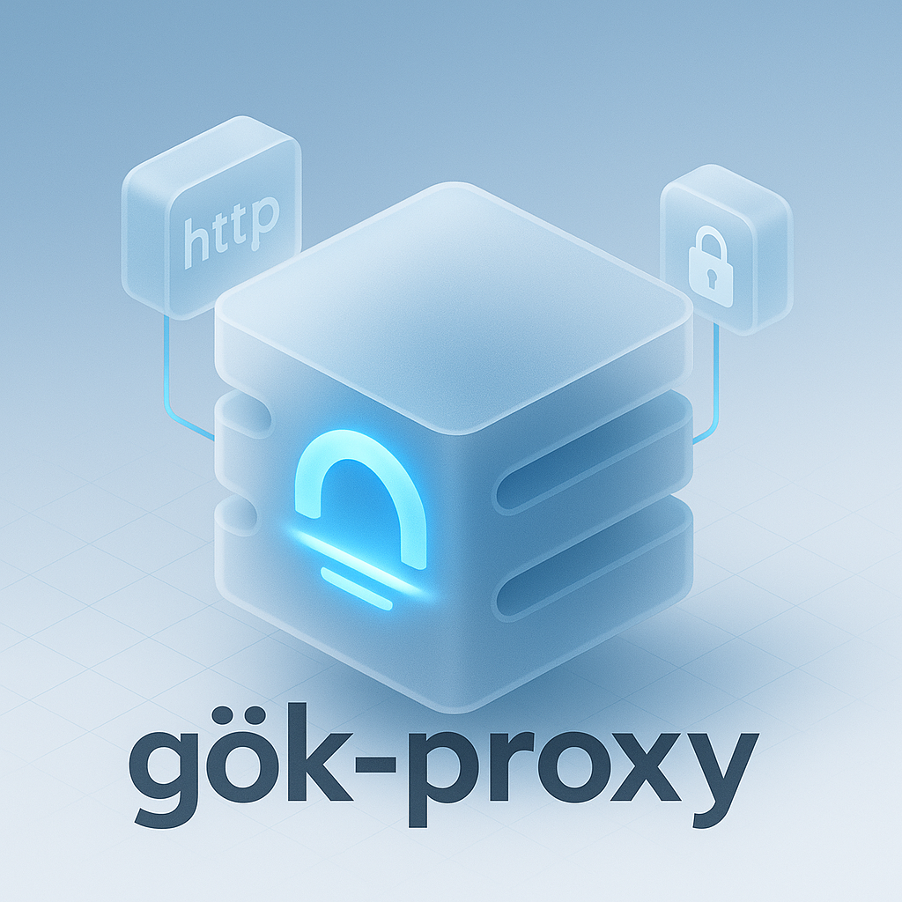

# gok-proxy: Lightweight High-Performance Go Proxy Server

**`gok-proxy` (Gök, Turkish for "sky") is a lightweight, high-performance, and scalable HTTP/HTTPS proxy server built with Go. It leverages `fasthttp` for exceptional speed and efficiency.**

## Overview

`gok-proxy` offers a modern, performant alternative to traditional proxy solutions. Designed for speed, scalability, and ease of use, it provides robust HTTP/1.1 and HTTPS proxying capabilities. Key aspects include structured logging via `slog`, Prometheus metrics integration for comprehensive monitoring, and flexible configuration through `viper`.

## Core Features

- **Exceptional Performance**: Built on Go's concurrency model and the `fasthttp` library for optimal resource utilization and high-throughput request handling.
- **HTTP/1.1 Support**: Full proxying capabilities for HTTP/1.1 traffic.
- **HTTPS Proxying (CONNECT Tunneling)**: Securely tunnels HTTPS traffic using the HTTP CONNECT method.
- **Structured Logging**: Employs `slog` (Go's standard structured logging package) for clear, configurable, and machine-parsable logs.
- **Prometheus Metrics**: Seamless integration with Prometheus for comprehensive operational metrics and monitoring.
- **Flexible Configuration**: Easy configuration management via a `config.yaml` file using `viper`, with sensible defaults.
- **Graceful Shutdown**: Handles OS signals for clean termination, preventing abrupt disconnections and ensuring in-flight requests are processed.
- **Connection Pooling**: Optimizes outgoing client connections for proxied requests using `sync.Pool` for `fasthttp.Client` instances, enhancing reuse and performance.

## Prerequisites

- Go 1.24.2 or newer.
- A Unix-like environment (Linux, macOS) is recommended for development and deployment.

## Quick Start

Follow these steps to get `gok-proxy` up and running quickly.

### 1. Clone the Repository

```bash
git clone https://github.com/josephgoksu/gok-proxy.git
cd gok-proxy
```

### 2. Install Dependencies (Optional)

Go modules typically manage dependencies automatically. To download them explicitly:

```bash
go mod download
```

### 3. Build the Executable

```bash
go build -o gok-proxy-proxy ./cmd/proxy/
```

This command compiles the proxy server and creates an executable named `gok-proxy-proxy` in the project's root directory.

### 4. Initial Configuration (Optional)

`gok-proxy` can run with default settings. For customization, create a `config.yaml` file in the project root. If this file is absent, `gok-proxy` will use its default configuration values.

See the **Detailed Configuration** section below for more information. A sample configuration:

```yaml
ServerAddress: ":8080"
MaxConnections: 10000
LogLevel: "info"
```

### 5. Run gok-proxy

Execute the compiled binary:

```bash
./gok-proxy-proxy
```

The proxy server will start, and log output (by default, to stdout) will indicate its status.

### 6. Test Your Setup

Use a tool like `curl` to verify the proxy. Replace `127.0.0.1:8080` if your `ServerAddress` configuration is different.

**HTTP Request:**

```bash
curl -x http://127.0.0.1:8080 http://ifconfig.io
```

**HTTPS Request (via CONNECT tunnel):**

```bash
curl -p -x http://127.0.0.1:8080 https://ifconfig.io
```

_(The `-p` flag instructs `curl` to use the CONNECT method for HTTPS proxying.)_

## Detailed Configuration

`gok-proxy` uses a `config.yaml` file in the project root for configuration. If the file does not exist, default settings are applied. All available options and their defaults are defined in `pkg/config/config.go`.

**Sample `config.yaml`:**

```yaml
# Server-side settings
ServerAddress: ":8080" # Address and port for the proxy server to listen on
MaxConnections: 10000 # Max concurrent connections per source IP for the fasthttp server
MaxRequestsPerConn: 5000 # Max requests per incoming connection (server-side)
LogLevel: "info" # Logging level: "debug", "info", "warn", "error"

# Client-side connection pool settings (for outgoing proxied requests)
ClientReadTimeoutSeconds: 15 # Read timeout for outgoing client connections
ClientWriteTimeoutSeconds: 15 # Write timeout for outgoing client connections
ClientMaxIdleConnDurationSeconds: 60 # Max duration an idle connection is kept in the pool
ClientMaxConnsPerHost: 512 # Max connections per host for the outgoing client
```

Adjust these values based on your operational requirements and system capabilities.

## Performance & Load Testing with k6

This project includes a k6 load test script (`loadtest/gok_proxy_loadtest.js`) to evaluate the proxy's performance.

### Prerequisites for Load Testing

1.  **Install k6**: Follow the [official k6 installation guide](https://k6.io/docs/getting-started/installation/).
2.  **Ensure `gok-proxy` is Running**: Your compiled `gok-proxy` server should be running locally (default: `http://localhost:8080`).
    ```bash
    ./gok-proxy-proxy
    ```

### Running the Load Test

Navigate to the project root directory and execute:

```bash
HTTP_PROXY=http://localhost:8080 k6 run loadtest/gok_proxy_loadtest.js
```

- The `HTTP_PROXY` environment variable directs k6 to route its requests through your `gok-proxy` instance.
- The script tests proxied HTTP GET requests (to `http://httpbin.org/get`) and proxied HTTPS GET requests (to `https://httpbin.org/get`, which uses CONNECT).
- Results are displayed in the console, and an HTML report is generated at `loadtest/summary.html`.

## Using `gok-proxy` as a Library

While `gok-proxy` is primarily a standalone application, its core components can be used as a library within other Go projects.

1.  **Add `gok-proxy` as a dependency:**
    ```bash
    go get github.com/josephgoksu/gok-proxy
    ```
2.  **Integration:**
    You can import packages like `pkg/proxy`, `pkg/config`, `pkg/handler`, etc., to leverage specific functionalities. The `cmd/proxy/main.go` file serves as a comprehensive example of how these components are initialized and wired together, including server setup, configuration loading, handler registration, and metrics integration. Study `main.go` to understand how to instantiate and use the proxy server programmatically.

## Contributing

Contributions, issues, and feature requests are welcome!

1.  Fork the Project.
2.  Create your Feature Branch (`git checkout -b feature/AmazingFeature`).
3.  Commit your Changes (`git commit -m 'Add some AmazingFeature'`).
4.  Push to the Branch (`git push origin feature/AmazingFeature`).
5.  Open a Pull Request.

Please adhere to Go best practices and include tests where applicable.

## Acknowledgements

- [fasthttp](https://github.com/valyala/fasthttp): For its foundational high-performance HTTP client/server capabilities.
- `slog` (Go standard library): For robust structured logging.
- [viper](https://github.com/spf13/viper): For versatile configuration management.
- [Prometheus](https://prometheus.io/): For industry-standard metrics collection.
- [k6](https://k6.io/): For powerful load testing.

## License

Distributed under the MIT License. See the `LICENSE` file for more information.
